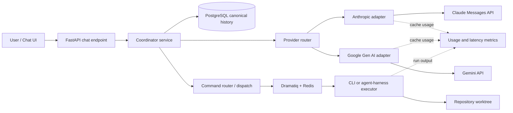

# Coordinator SDK Architecture

Status: proposed

Research task: CTV2-047

Research date: 2026-07-26

## Executive decision

Use SDK-direct model calls for the interactive coordinator, with PostgreSQL as
the canonical conversation store. Keep the existing CLI/Dramatiq path for
autonomous coding-agent execution.

For the coordinator provider adapters, use:

- `anthropic` for Claude.
- `google-genai` for Gemini when portable history and explicit cache control
  are required.
- `google-antigravity` only for work that needs the Antigravity agent harness
  (built-in tools, policies, hooks, skills, subagents, and local trajectory
  persistence), not as the default Gemini chat transport.

This is a hybrid architecture, but the boundary is by responsibility rather
than by model:

- Coordinator conversation: direct model SDK.
- Executor/reviewer work in a repository: CLI or Antigravity agent harness.

Do not fall back to a CLI merely because the user switches coordinator model.
The new SDK adapter can load the same canonical history from PostgreSQL. The
switch causes a provider cache miss, but it does not need to lose semantic
context.

## Why this decision

The current code has two distinct paths:

1. `backend/app/api/chat.py` sends the full `Session.messages` JSON history
   through `backend/app/services/llm.py`.
2. Task dispatch builds one-shot `claude`, `agy`, or `codex` commands in
   `backend/app/services/command_builder.py`, then starts a subprocess from the
   Dramatiq worker.

The first path is already close to an SDK-direct coordinator. The second is a
good isolation boundary for coding agents that need a working directory,
shell, cancellation, retries, and streamed process output. Replacing both
paths with the same abstraction would mix two different workloads.

Google describes the Antigravity SDK as a Python agent framework using the
same harness as Antigravity CLI and Antigravity 2.0. It is not the direct
Gemini equivalent of the `anthropic` package. The SDK installs a compiled
runtime binary, and `Agent` manages that binary, tool wiring, hooks, and
policies. Its strengths are agent execution rather than a lightweight,
provider-neutral chat call. See the
[Antigravity SDK overview](https://antigravity.google/docs/sdk/overview) and
[SDK repository README](https://github.com/google-antigravity/antigravity-sdk-python).

## Recommended architecture



The coordinator service owns:

- Session/model selection.
- Canonical message persistence.
- Provider-format conversion.
- Context-window budgeting and summarization.
- Cache policy and cache metrics.
- Streaming normalization.
- Turn-level retry/idempotency.

Provider adapters own only provider-specific request and response details.
Executor agents remain behind the existing queue/process boundary.

## SDK comparison

| Capability | Anthropic Python SDK | Antigravity Python SDK | Google Gen AI SDK |
|---|---|---|---|
| Package | `anthropic` | `google-antigravity` | `google-genai` |
| Primary abstraction | Stateless model API client | Stateful autonomous-agent harness | Gemini model API client |
| Basic call | `client.messages.create(...)` | `await agent.chat(...)` | `client.models.generate_content(...)` |
| Async and streaming | Yes | Yes, including text, thought, and tool-call streams | Yes |
| Conversation behavior | Caller resends history | `Conversation` accumulates steps | Chat helper accumulates and resends history; raw API is stateless |
| Durable session | Application responsibility | `conversation_id` + `save_dir` can resume local harness state | Application responsibility, unless using a provider stateful API |
| Built-in coding tools/policies | No; application implements tools | Yes | No; application implements tools |
| Prompt/context caching | Automatic or explicit breakpoints | Gemini implicit caching may apply; usage is exposed | Implicit and explicit caching |
| Explicit TTL/cache object control | Claude `cache_control`, 5m or 1h | Not exposed by the public SDK as of v0.1.8 | `client.caches.create/update/delete` with TTL |
| Portable across Claude/Gemini | Yes, through an application-owned canonical schema | No direct history-import API at the high-level `Agent` boundary | Yes, through an application-owned canonical schema |
| Local child-process overhead | No | Yes; bundled Antigravity harness runtime | No |
| Best fit in Control Tower | Claude coordinator adapter | Tool-using executor or specialized agent | Gemini coordinator adapter |

### Claude: Messages API

The Claude Messages API accepts a top-level `system` value and an ordered list
of `user`/`assistant` messages. It is stateless: every request supplies the
history that Claude should see. The API supports content blocks, tool use,
images/documents, sync/async clients, streaming, request IDs, configurable
timeouts, and automatic SDK retries. See the
[Messages API reference](https://platform.claude.com/docs/en/api/python/messages/create)
and [Python SDK guide](https://platform.claude.com/docs/en/cli-sdks-libraries/sdks/python).

Minimal asynchronous coordinator call:

```python
from anthropic import AsyncAnthropic

client = AsyncAnthropic()

response = await client.messages.create(
    model=model_name,
    max_tokens=2048,
    system=system_blocks,
    messages=provider_messages,
    cache_control={"type": "ephemeral"},
)
```

Important integration notes:

- A `system` role must be converted to the top-level `system` parameter.
- Persist the returned content blocks before acknowledging a completed turn.
- Preserve tool-use IDs while a Claude tool loop is active.
- Log `response._request_id`, model, stop reason, and all usage fields.
- Use streaming for long responses, but persist one logical assistant message,
  not one database message per stream delta.

The repository already imports `anthropic`, but the current implementation
does not enable prompt caching and recreates a client for every call. The new
adapter should reuse one async client per FastAPI worker and pin a tested SDK
version rather than relying only on `anthropic>=0.18.0`.

### Antigravity: agent SDK and Gemini integration

The public SDK API is:

```python
from google.antigravity import Agent, LocalAgentConfig

config = LocalAgentConfig(
    model="gemini-3.6-flash",
    system_instructions="You are the Control Tower coordinator.",
    save_dir="/durable/antigravity/sessions",
)

async with Agent(config) as agent:
    response = await agent.chat("What should happen next?")
    text = await response.text()
```

As of repository tag v0.1.8:

- The default text model is Gemini 3.6 Flash.
- `LocalAgentConfig(model=...)` selects a Gemini model.
- Gemini Developer API keys and Vertex/enterprise authentication are
  supported.
- `Conversation` tracks history, turns, compaction points, and cumulative
  token usage.
- A session can be resumed across process restarts by reusing both
  `conversation_id` and `save_dir`; see Google's
  [persistence example](https://github.com/google-antigravity/antigravity-sdk-python/blob/7ff4dfa874cf6b17397d7d6b6619a266b7530033/examples/getting_started/persistence.py).
- Usage metadata includes `cached_content_token_count`; see the SDK's
  [usage type](https://github.com/google-antigravity/antigravity-sdk-python/blob/7ff4dfa874cf6b17397d7d6b6619a266b7530033/google/antigravity/types.py).

There are two limitations for this coordinator design:

1. Persistence is harness-owned local state. It is useful for resuming the
   same Antigravity conversation, but it is not a portable transcript that can
   be sent directly to Claude.
2. The public v0.1.8 configuration exposes cached-token metrics but no
   `cache_control`, `cached_content`, cache-object creation, or TTL management.
   Therefore, the SDK can benefit from Gemini implicit caching, but Control
   Tower cannot request a guaranteed explicit cache through this API.

If Antigravity must be used in a server process, an `Agent` must be kept alive
or reconstructed with a durable `save_dir`. FastAPI workers would also need
session affinity or a separate agent-runtime service. That added lifecycle is
not justified for the coordinator's ordinary chat and command-routing path.

### Direct Gemini alternative

The Google Gen AI SDK is the appropriate peer to the Anthropic SDK:

```python
from google import genai

client = genai.Client()
response = client.models.generate_content(
    model=model_name,
    contents=provider_contents,
)
```

Its chat helper manages history in memory, but the helper still sends the full
history to `generateContent`; REST itself is stateless. See Google's
[Gemini API getting-started guide](https://ai.google.dev/gemini-api/docs/generate-content/get-started).

For explicit caching, the same SDK can create a model-bound cache and pass its
name as `cached_content`. See
[Gemini explicit context caching](https://ai.google.dev/gemini-api/docs/generate-content/caching).
This gives Control Tower the control that the Antigravity SDK does not expose.

## Prompt caching deep dive

### Caching is not conversation storage

A prompt cache is an optimization of repeated input-prefix processing. It is
not a durable transcript, and a cache hit must never be required for
correctness.

PostgreSQL must remain sufficient to reconstruct every model request after:

- Cache expiry or eviction.
- Application restart.
- Provider outage/failover.
- Model change.
- Provider change.
- Credential/workspace change.

Provider cache identifiers and expiry timestamps are disposable acceleration
metadata.

### Claude caching

Claude supports two modes:

- Automatic caching: add top-level `cache_control`; the breakpoint advances
  as a multi-turn conversation grows.
- Explicit breakpoints: put `cache_control` on selected content blocks after
  stable tools, system instructions, examples, or reference context.

The default TTL is five minutes and refreshes on a hit. A one-hour TTL is
available at a higher write price. Current pricing multipliers are:

- Five-minute write: 1.25 times base input price.
- One-hour write: 2 times base input price.
- Cache read/refresh: 0.1 times base input price.

Thus, “about 90% savings” applies only to the reusable input tokens on a cache
hit. It does not apply to output tokens, new input, cache writes, or the whole
request. A five-minute cache is cheaper on the second use of a reusable prefix;
a one-hour cache needs at least two later reads to recover its higher write
cost, before considering latency value.

Minimum cacheable length is model-dependent. Requests below the threshold
silently run uncached, so success must be checked through
`cache_creation_input_tokens` and `cache_read_input_tokens`.

Source: Anthropic's
[prompt caching guide](https://platform.claude.com/docs/en/build-with-claude/prompt-caching).

Recommended Claude policy:

1. Put tool definitions and versioned coordinator instructions first.
2. Keep dynamic timestamps, task status, and the newest user message after the
   stable prefix.
3. Enable automatic five-minute caching for interactive sessions.
4. Add an explicit stable-prefix breakpoint if automatic caching churns on
   dynamic content.
5. Use one-hour caching only when measured session cadence justifies it.
6. Export cache-write, cache-read, uncached-input, output, and TTFT metrics.

### Gemini and Antigravity caching

Gemini 2.5 and newer models support implicit prefix caching. It is enabled by
default, and hits are more likely when large common content is at the start
and requests with the same prefix occur close together. Cached token counts
are reported in usage. Current Google documentation describes cached input as
a 90% discount for supported current models, though model and platform pricing
must be read at deployment time.

Gemini also supports explicit `CachedContent` objects through `generateContent`:

- The cache is tied to a model.
- A caller chooses a TTL; the documented default is one hour.
- Cache creation/storage and discounted cached-input reads are billed
  separately.
- Cache metadata can be listed, updated, and deleted.
- Cached tokens still count toward the model context window.

Sources:

- [Gemini implicit context caching](https://ai.google.dev/gemini-api/docs/caching/)
- [Gemini explicit context caching](https://ai.google.dev/gemini-api/docs/generate-content/caching)
- [Google caching cost explanation](https://cloud.google.com/blog/products/ai-machine-learning/vertex-ai-context-caching)

Antigravity forwards Gemini cached-token usage into
`cached_content_token_count`, so cache effectiveness is observable. No public
Antigravity v0.1.8 API was found for explicitly creating or attaching a Gemini
cache. Use Google Gen AI SDK when an explicit cache is a requirement.

### CLI versus SDK caching

“CLI has no cache” is too broad. A CLI can use provider prompt caching
internally. For example, Antigravity CLI v1.1.7 reports `cache_read_tokens` in
headless JSON output; see the
[Antigravity CLI changelog](https://github.com/google-antigravity/antigravity-cli/blob/main/CHANGELOG.md).
However, the current Control Tower invocation starts `agy --print` with a
standalone task prompt and neither resumes a conversation nor supplies the
coordinator's prior history. It therefore provides little repeated
conversational prefix for a cache to reuse.

| Scenario | Current one-shot CLI spawn | Direct SDK coordinator |
|---|---|---|
| Same model, growing conversation | No history is supplied by Control Tower; any cache behavior is opaque | Full canonical history supplied; cache policy and usage are observable |
| Repeated stable project context | CLI-dependent and difficult to control | Explicit stable prefix/cache object where supported |
| Same provider, different model | Treat as a cache miss | Treat as a cache miss; reload DB context |
| Claude to Gemini switch | New process and no portable CLI session | New adapter call with translated DB history |
| New application process | New CLI process | DB history restores correctness; provider cache may hit or miss |
| TTL selection | Not controlled by Control Tower | Controlled for Claude and explicit Gemini caching |
| Cost attribution per session | Requires parsing CLI-specific output | Normalize provider usage into one metrics schema |
| Startup overhead | Process and CLI/harness startup every invocation | HTTP client reuse; no child process for direct model SDKs |

The SDK advantage is control and observability, not the mere fact that Python
instead of a command line is used.

## Context preservation and model switching

### Guarantee

Model switching preserves the user-visible conversation and relevant tool
results. It cannot preserve:

- A provider's hidden reasoning state.
- KV/prompt cache entries across models or providers.
- Provider-specific server-side tool state unless Control Tower separately
  persists and replays it.

The guarantee is therefore semantic context preservation, not binary provider
state preservation.

### Canonical message model

The existing `Session.messages` JSON array is enough for a prototype but is
unsafe as the long-term source of truth: concurrent read-modify-write can lose
messages, individual turns cannot be indexed or idempotently retried, and
provider-specific blocks are not typed.

Add normalized records:

```text
coordinator_sessions
  id
  task_id
  selected_provider
  selected_model
  system_prompt_version
  context_revision
  summary_through_sequence
  created_at / updated_at

coordinator_messages
  id
  session_id
  sequence
  role                  # system | user | assistant | tool
  content_json          # typed text/media/tool-call/tool-result parts
  provider
  model
  provider_response_id
  request_id
  usage_json
  status                # pending | complete | failed
  created_at

coordinator_provider_state
  session_id
  provider
  model
  external_conversation_id
  cache_ref
  cache_expires_at
  metadata_json
```

Use a unique constraint on `(session_id, sequence)` and an idempotency key for
each submitted turn. Keep provider state optional and disposable.

### Switch algorithm

Only switch models at a turn boundary, not halfway through a provider tool
loop.

1. Lock the session and persist the user's new message.
2. Resolve the selected `(provider, model)` against an allowlist.
3. Load ordered canonical messages through a committed sequence.
4. Materialize provider-neutral context:
   - Preserve user-visible text and media references.
   - Convert completed tool calls/results to the target provider's format.
   - Exclude private thinking blocks.
   - If the target provider cannot represent a historical block, insert a
     clearly labelled textual record rather than silently dropping it.
5. Apply context budgeting. Use a versioned summary of older turns plus recent
   verbatim turns when the full history exceeds the target context budget.
6. Render the target adapter request with the stable system prefix first.
7. Discard any cache reference belonging to a different provider or model and
   expect a cold request.
8. Stream the response while buffering it server-side.
9. Atomically persist the complete assistant response, provider/model,
   request ID, token usage, and new selected model.

If a request fails after streaming begins, retain the partial attempt as
failed metadata but do not include it in future model context unless the user
explicitly asks to recover it.

### Context compaction

Use deterministic budgeting rather than letting each provider independently
truncate history:

```text
stable system instructions
+ durable task/project facts
+ versioned summary through message N
+ verbatim messages N+1..latest
+ current user message
```

Store the summary's source watermark, summarizer model, prompt version, and
hash. Never overwrite the original messages. Regenerate the summary when its
prompt version changes or when switching to a model with materially different
context needs.

## CLI spawn versus SDK direct

| Dimension | CLI spawn | SDK direct |
|---|---|---|
| Isolation | Strong process/working-directory boundary | Shares API process unless moved to a service |
| Agent tools | Mature CLI/harness tools available | Coordinator must define only the tools it needs |
| Latency | Repeated startup/auth/config discovery | Connection pooling and client reuse |
| Context | CLI session-specific; current code uses one-shot prompts | Application controls canonical history |
| Cache control | Opaque or CLI-specific | Provider APIs and normalized metrics |
| Streaming | Parse stdout or CLI JSON formats | Typed SDK streaming events |
| Errors/retries | Exit codes and stderr; process-level retry | Typed API errors; request-aware retry |
| Cancellation | Signals/process tree, already implemented | Cancel async request; tool side effects need separate handling |
| Deployment | Requires installed/authenticated CLIs | Requires API credentials and SDK packages |
| Model switching | Different command; no shared current context | Adapter switch with DB rehydration |
| Best use here | Coding executors/reviewers | Interactive coordinator |

## Implementation plan

### Phase 1: persistence and interface

1. Introduce `CoordinatorProvider` with `stream(messages, model, options)` and
   a normalized stream event/usage result.
2. Add normalized session/message/provider-state tables and an Alembic
   migration.
3. Dual-write new messages to the normalized table and existing
   `Session.messages` during migration; then backfill and remove the JSON array
   as a write source.
4. Add provider/model fields to the chat request or a separate session
   settings endpoint. Validate them against server configuration.

### Phase 2: provider adapters

1. Extract the existing Anthropic logic into an async adapter.
2. Reuse one `AsyncAnthropic` client per worker.
3. Add automatic five-minute caching and usage/request-ID instrumentation.
4. Add a Google Gen AI adapter with implicit caching metrics.
5. Add explicit Gemini cache objects only for measured, large, stable context;
   store their disposable references in `coordinator_provider_state`.
6. Normalize stop reasons, rate-limit errors, timeouts, and retryability.

### Phase 3: safe switching and compaction

1. Implement canonical-to-Claude and canonical-to-Gemini renderers.
2. Enforce turn-boundary switching.
3. Add deterministic context budgets and versioned summaries.
4. Add idempotency, optimistic context revision checks, and one active
   generation per session.

### Phase 4: preserve agent execution

1. Keep `command_builder.py`, Dramatiq, `ProcessManager`, Redis streaming, and
   `AgentRun` for coding executor tasks.
2. Optionally add an `antigravity-sdk` executor backend when in-process custom
   policies/hooks are needed. Run it in a dedicated worker/service because it
   owns a harness process and durable local state.
3. Do not put long-lived Antigravity `Agent` objects in arbitrary FastAPI
   workers without session affinity and lifecycle recovery.

### Phase 5: rollout and measurement

1. Feature-flag SDK coordinator routing by provider.
2. Shadow-render prompts without sending them and compare token counts.
3. Roll out Claude first because the repository already contains an Anthropic
   adapter.
4. Add Gemini through Google Gen AI SDK.
5. Compare p50/p95 TTFT, total latency, cache-hit tokens, cost per completed
   turn, error rate, and context-switch answer quality.
6. Retire the old coordinator LLM path after parity and rollback tests pass.

## Verification plan

Unit tests:

- Canonical role/content conversion for both providers.
- Stable-prefix ordering and cache controls.
- Usage normalization, including cached-token fields.
- Context budget and summary watermark behavior.
- Model-switch cache reference invalidation.
- Idempotent message writes and retry classification.

Integration tests:

- Claude A → Claude A retains context and records a cache read after warm-up.
- Claude A → Claude B retains semantic context with an expected cold cache.
- Claude → Gemini → Claude preserves user-visible facts and tool results.
- Gemini same-model conversation reports implicit cached tokens when the
  provider returns a hit.
- Cache expiry does not change the answer context.
- Application restart reconstructs a session entirely from PostgreSQL.
- Concurrent requests to one session are serialized or one is rejected with a
  retryable conflict.
- A mid-tool-loop switch is rejected until the turn completes or is cancelled.

Operational checks:

- No API keys, private thinking, or raw secrets in logs.
- Provider request IDs are searchable.
- Cache hit ratio and cached/uncached input cost are visible per model.
- CLI executor cancellation/retry behavior remains unchanged.

## Risks and mitigations

| Risk | Mitigation |
|---|---|
| Provider formats diverge | Keep a small canonical schema and isolated renderers; preserve raw response metadata separately |
| Summary loses important context | Retain immutable original messages, version summaries, keep recent turns verbatim |
| Cache savings are overestimated | Measure cached token fields and total cost; never assume the whole request is 90% cheaper |
| Dynamic prompt content destroys prefix hits | Stable versioned instructions first; volatile state last |
| Concurrent turns corrupt history | Normalized append-only messages, sequence constraint, session revision/lock |
| Antigravity local state is lost | Use explicit durable `save_dir` for Antigravity executors; PostgreSQL remains coordinator truth |
| Long-lived SDK objects fail across workers | Reuse stateless HTTP clients per worker; put stateful harness agents behind an affinity-aware service |
| Tool semantics differ after a switch | Switch only at turn boundaries and normalize completed calls/results |

## Final recommendation

Adopt SDK-direct coordination with Anthropic and Google Gen AI adapters,
PostgreSQL-owned context, and expected cold-cache behavior on every model
change. Preserve the current CLI/Dramatiq runner for repository agents.

Do not make Antigravity SDK the default Gemini coordinator adapter. Use it
where its harness is the requirement. If direct Gemini caching is the
requirement, use Google Gen AI SDK; if cross-model continuity is the
requirement, use the canonical PostgreSQL transcript. These are separate
concerns and should remain separate in the architecture.
